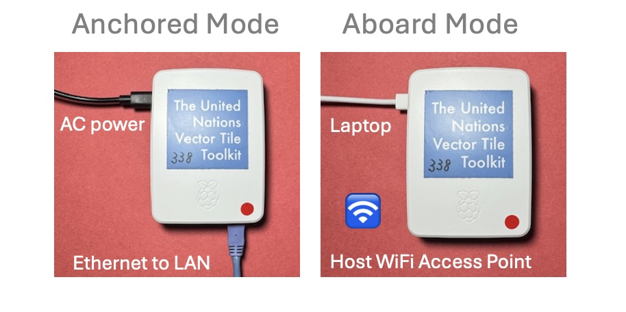
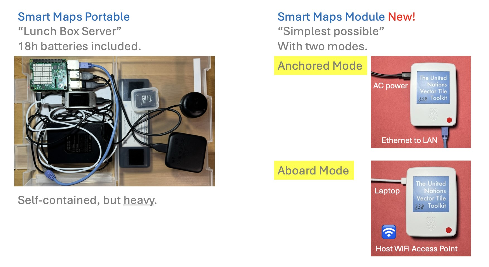
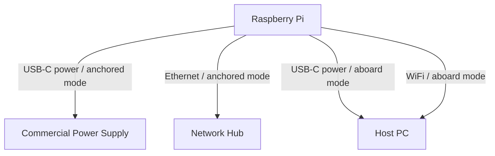

# UN Smart Maps Module

The **UN Smart Maps Module** is a flexible, portable, cloud-native web map server built on a Raspberry Pi. It is designed to host geospatial information efficiently and operates in two distinct modes:

- **Anchored Mode**: Utilizes commercial power and an Ethernet connection for indoor operations.
- **Aboard Mode**: Operates independently as a WiFi access point, powered by a laptop or portable battery.



The Module is tailored for portability, resilience against power outages, and simplicity in setup and use, supporting diverse geospatial application needs in both stable and dynamic environments.

---

## Project Background and Purpose

The UN Smart Maps Module aims to provide an accessible and adaptable geospatial server for strategic use of geospatial information. This initiative supports the United Nations' Sustainable Development Goals (SDGs) and aligns with JICA's strategic efforts in geospatial capacity building.

Our mission is to **”build a stage for thinking”**, enabling communities to leverage geospatial inforation in various contexts.

---

## Key Features

- **Two Operational Modes**:
  - **Anchored Mode**: Connects to Ethernet with DHCP and operates on commercial power.
  - **Aboard Mode**: Functions as a standalone WiFi access point (SSID: `smartmapsmodule`, Password: `smartmapsmodule`), powered by a host PC or portable battery.
- **Portable Storage**: Supports a 32GB microSD card for geospatial data hosting.
- **Resilience**: Automatically starts services upon power-on, ensuring reliability during power outages.
- **Cloud-Native Design**: Seamlessly integrates with modern web map technologies.
- **Network Management**: Uses NetworkManager CLI for flexible network configurations.

---

## Target Users and Use Cases

### **Target Users**
- **Governments**: For hosting local geospatial data without internet dependency.
- **NGOs and communities**: For geospatial sense making and decision making in cases like disaster response.
- **Educators**: For teaching and training on open-source geospatial tools.
- **Field Researchers**: For portable mapping in the field.

### **Key Use Cases**
1. **Community Development**: Supporting local planning with geospatial data hosting in resilient, light-weight and stable environments.
2. **Educational Training**: Hosting local maps for interactive learning.
3. **Disaster Response**: Rapid geospatial data sharing in power-limited areas.

---

## System Configuration

### **1. Hostname and User Configuration**
- **Hostname**: `module.local`
- **Default Username**: `module`
- **Default Password**: `module`

### **2. WiFi Access Point (Aboard Mode)**
- **SSID**: `smartmapsmodule`
- **Password**: `smartmapsmodule`
- **Configuration**:
  ```bash
  sudo nmcli dev wifi hotspot ifname wlan0 ssid "smartmapsmodule" password "smartmapsmodule"
  ```

### **3. Anchored Mode (DHCP)**
- Connects via Ethernet (`eth0`) and obtains an IP address using DHCP. No additional configuration is required.

### **4. Internet Sharing**
The Module can share its Ethernet-based internet connection with clients connected via WiFi (`wlan0`). This is achieved through IP forwarding and NAT.

---

## Comparison: Smart Maps Portable vs. Smart Maps Module

| Feature                  | Smart Maps Portable                     | Smart Maps Module                      |
|--------------------------|------------------------------------------|----------------------------------------|
| **Power**               | Internal battery (18h runtime)          | External power (AC, battery, or USB-C) |
| **Portability**         | Self-contained but heavier              | Lightweight and modular                |
| **Operational Modes**   | Single mode                             | Anchored and Aboard                    |
| **Use Case**            | Field operations with built-in battery  | Flexible environments, adaptable power |



---

## Example Diagram



---

## Troubleshooting

### **Common Issues**
- **No Internet Access in Aboard Mode**: Ensure IP forwarding and `iptables` rules are correctly configured.
- **WiFi AP Not Visible**: Restart NetworkManager:
  ```bash
  sudo systemctl restart NetworkManager
  ```

### **Logs**
- Check service logs:
  ```bash
  sudo journalctl -u NetworkManager
  sudo journalctl -u caddy
  ```

---

## Contribution Guidelines

We welcome contributions to improve the Module. To get started:
- **Report Issues**: Use the GitHub Issues tab for bug reports or feature requests.
- **Submit Pull Requests**: Include detailed documentation.
- **Join Discussions**: Participate in community discussions to share ideas and feedback.

---

## Future Enhancements

- Expand storage support beyond 32GB microSD.
- Add advanced geospatial data management tools.
- Explore additional power management features.

---

## See Also

- [The GitHub Issue where Smart Maps Module has first appeared](https://github.com/UNopenGIS/7/issues/610)
- [Smart Maps report for 2024-12](https://hackmd.io/@smartmaps/2024-12#/4)

---

For further assistance, please contact the UN Smart Maps Group.

